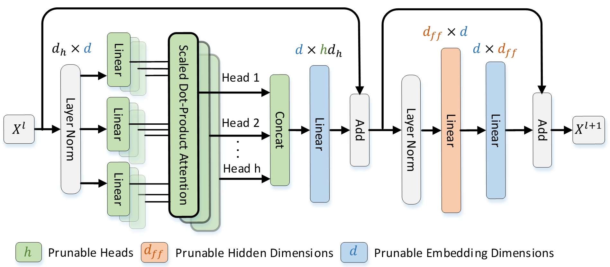

# SAViT: Structure-Aware Vision Transformer Pruning via Collaborative Optimization [NeurIPS 2022]

This repository contains PyTorch implementations for SAViT.
For details see [SAViT: Structure-Aware Vision Transformer Pruning via Collaborative Optimization](https://proceedings.neurips.cc/paper_files/paper/2022/hash/3b11c5cc84b6da2838db348b37dbd1a2-Abstract-Conference.html)

SAViT is a structured pruning method to prune the following comopnents in vision trnasofmrer and reaches 2.05x speedup with only 0.2% accuracy loss.




## Setup
Step 1: Create a new conda environment:
```
conda create -n savit python=3.8
conda activate savit
```
Step 2: Install relevant packages
```
cd /path to deit_savit 
pip install -r requirements.txt
```

## Data preparation

Download and extract ImageNet train and val images from http://image-net.org/.
The directory structure is the standard layout for the torchvision [`datasets.ImageFolder`](https://pytorch.org/docs/stable/torchvision/datasets.html#imagefolder), and the training and validation data is expected to be in the `train/` folder and `val` folder respectively:

```
/path to imagenet
  train/
    class1/
      img1.jpeg
    class2/
      img2.jpeg
  val/
    class1/
      img3.jpeg
    class/2
      img4.jpeg
```

## Prune
The scripts folder contrains all the bash commands to replicate the main results in our paper:

Running following command for pruning deit-base will give you a pruned model with mask indicates which neuron or head should be removed, corresponding to the results in Table 2.

<details>

<summary>
Prune deit-base 50% FLOPs
</summary>

```
python main.py \
    --finetune=/path to deit_base checkpoint \
    --batch-size=32 \
    --num_workers=16 \
    --data-path=/path to ImageNet \
    --model=deit_base_patch16_224 \
    --pruning_per_iteration=100 \
    --pruning_feed_percent=0.1 \
    --pruning_method=2 \
    --pruning_layers=3 \
    --pruning_flops_percentage=0.50 \
    --pruning_flops_threshold=0.0001 \
    --need_hessian  \
    --finetune_op=2 \
    --epochs=1 \
    --output_dir=/path to output
```

</details>

You can change FLOPs reduction or model as you wish.
If you have already get pruning importance metric, you can simply load them by setting:
```python
--pruning_pickle_from=/path to importance
```
For help information of the arguments please see main.py.
## Fine-tune
For deit-base after pruning, we need to retrain the pruned model to recover their performance. Run following command for fine-tuning on ImageNet on a single node with 8 gpus with a total batch size of 1024 for 300 epochs.

<details>

<summary>
Fine-tune pruned DeiT-base
</summary>

```
GPU_NUM=8
output_dir=/path to output
ck_dir=$output_dir/checkpoint.pth
# check if checkpoint exists
if [ -e $ck_dir ];then
   CMD="--resume=${ck_dir}"
else
   CMD="--resume="
fi
python -m torch.distributed.launch --nproc_per_node=${GPU_NUM}  --use_env  main_deploy.py \
    --dist-eval \
    $CMD \
    --masked_model=/path to pruned_model in previous step prune \
    --teacher-path=/path to regnet model as deit paper\
    --batch-size=128\
    --num_workers=16 \
    --data-path=/path to ImageNet \
    --model=deit_base_patch16_224_deploy \
    --pruning_flops_percentage=0 \
    --finetune_op=1 \
    --epochs=300 \
    --warmup-epochs=0 \
    --cooldown-epochs=0 \
    --output_dir=$output_dir
```

</details>

**Note:** fine-tuning is runing the main_deploy.py, which generates a smaller model according to the pruning mask in pruned model from previous step prune to accelerate fine-tuning.

To ease reproduction of our results we provide prune and finetune [logs folder](.logs). The slight difference between results in logs and results in our paper comes from PyTorch version.
# Acknowledgement
Our repository is built on the [Deit](https://github.com/facebookresearch/deit/blob/main/README_deit.md), [Taylor_pruning](https://github.com/NVlabs/Taylor_pruning), [Timm](https://github.com/huggingface/pytorch-image-models) and [flops-counter](https://github.com/sovrasov/flops-counter.pytorch), we sincerely thank the authors for their nicely organized code!
# License
This repository is released under the Apache 2.0 license as found in the [LICENSE](LICENSE) file.
# Citation
If you find this repository helpful, please cite:

```
@article{zheng2022savit,
  title={SAViT: Structure-Aware Vision Transformer Pruning via Collaborative Optimization},
  author={Zheng, Chuanyang and Zhang, Kai and Yang, Zhi and Tan, Wenming and Xiao, Jun and Ren, Ye and Pu, Shiliang and others},
  journal={Advances in Neural Information Processing Systems},
  volume={35},
  pages={9010--9023},
  year={2022}
}
```